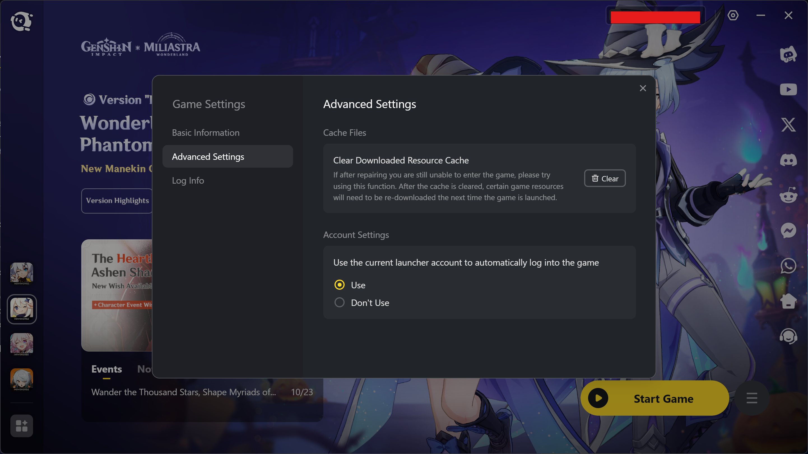

# Enable HoYoPass in HoYoPlay

This repository contain script that enable ability to Login to HoYoPlay using your HoYoverse or miHoYo account and enable Account Switching.

This script works for the following Launchers:

- HoYoPlay
- 米哈游启动器 (miHoYo Launcher)
- Standalone Google Play Launcher (Genshin Impact and Honkai Impact 3rd) - Appilcation Detection does not work.
- Epic Games Launcher - Appilcation Detection does not work.

Note: Only works for one active HoYoPlay launcher. It cannot change multiple launchers at once.

Made this cuz I'm lazy and have nothing to do...

## Preview - Global

### Disabled

### Enabled

## Preview - CN

### Disabled

### Enabled

## Prerequisites

To make this work, you will need to change all the shortcuts of HoYoPlay to have `--remote-debugging-port=9222`. This enables Qt Launcher WebView DevTools

You can customize the Port however you want but you will need to set the script to also use that port.

Because HoYoPlay has URI Protocols, the script also changes the Protocols to enable DevTools. So websites that interacts with the launcher will still work correctly.

If you wish to set it up manually, follow the steps [here]()

For Shortcuts:

- Desktop: Locate HoYoPlay or 米哈游启动器 on Desktop, right click and select Properties. Keyboard Shortcut if you want to make this quick: Alt + Enter
  - In the "Target" box, add `--remote-debugging-port=9222` next to `launcher.exe`.
  - It should look like this: `Target: "C:/Program Files/HoYoPlay/launcher.exe" --remote-debugging-port=9222`

- Start Menu: Both the Desktop Shortcut and Start Menu shortcut as well the shortcut that you find when searching HoYoPlay in Windows Search acts differently. To make sure both of them using Remote Debug Argument correctly, find HoYoPlay or 米哈游启动器 Start Menu Shortcut.
  - Global Shortcut Location: `%appdata%\Microsoft\Windows\Start Menu\Programs\HoYoPlay`
  - CN Shortcut Location: `%appdata%\Microsoft\Windows\Start Menu\Programs\米哈游启动器`
  - The steps to change are the same as the Desktop Shortcut. Also after changing the start menu shortcut, the Shortcut in Windows Search will also reflect the change.

## FAQ

Q: What does it do after enabling it?

A: There is an additional settings that once you enable login, allows you to login to the game using the Launcher current account to login. This reduce the step for user logging in to each indiviual game every time.

Q: Why can't I use Google, Apple, Twitter or Facebook to login.

A: Disabled Internally, I cannot change that.

Q: What each file does?

A:

- `Monitor.ps1`: Automated Script that enables Login everytime HoYoPlay starts. On Quit, set URI to work correctly when visiting a website that asks you to open HoYoPlay. Made only to work with Official Launcher.
- `Monitor_Other.ps1`: Automated Script that enables Login everytime HoYoPlay starts. Made only to work with Third-party store Launcher.
- `enable_login.ps1`: Standalone Manual Script that enables login. Enables when user runs the script, Does not check if HoYoPlay is open or is running

Q: Why does Epic or Google Launcher doesn't work?

A: The script rely on URI Protocols of the official launcher and not the third-party store launchers. For Google, you can follow the above steps to make it work. But only work with the `Monitor_Other.ps1` script as the URI Protocols are not widely use by HoYo on their websites. For Epic Games, you can config it in the game settings to run the Debug Port Command Line Argument.

Q: Why does BiliBili Launcher doesn't work? 

A: BiliBili Launcher will never work because HoYo have disabled the functionality in the code.

Q: Are there any security risk doing so?

A: Running the script only enables Login functionality and does not do anything else after that besides monitoring when HoYoPlay open and closes and reset the URI Protocol. We do not steal anything, you can check the code to confirm it. But it does open a risk of hackers using the DevTools Port to get your account information and I do acknowledge that risk. So we advice user to use this script with caution, **do not click weird links or give anyone access to your computer or network. You are responsible for protecting your account.**